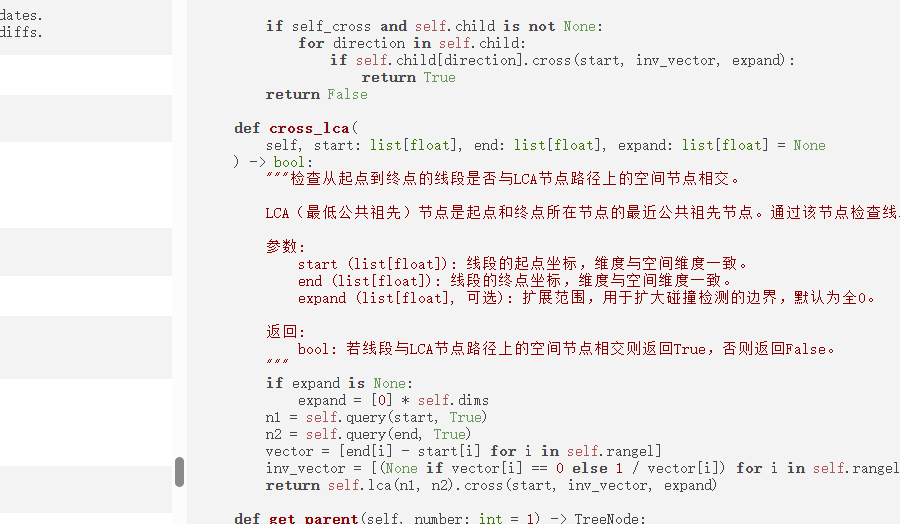

# AIDocMe - AI驱动的Python文档生成工具
*注意：本README文档主要由Deepseek-R1生成，仅供参考*

AIDocMe是一个基于AI的Python文档生成工具，能够自动为Python代码生成高质量的文档字符串(docstrings)。它结合了AST解析和AI技术，提供直观的界面来查看、编辑和导出带有完整文档的代码。
## 地址：[https://SunZhongjie.pythonanywhere.com](https://SunZhongjie.pythonanywhere.com)

## 演示视频

[](https://www.bilibili.com/video/BV1PsKJz8Euq/)

## 功能特性

- **AI驱动的文档生成**：利用大型语言模型自动生成模块、类和函数的文档字符串
- **三视图界面**：同时显示文档视图、代码视图和分段视图
- **实时编辑**：直接在前端编辑文档字符串并查看效果
- **多种导出选项**：
  - 复制代码到剪贴板
  - 下载完整的Python文件
  - 上传现有Python文件进行处理
- **多语言支持**：支持中文和英文文档生成
- **智能配置**：可自定义AI模型、API密钥和其他参数

## 技术栈

- **前端**：
  - HTML/CSS/JavaScript
  - Highlight.js - 代码高亮
  - SweetAlert2 - 美观的弹窗
- **后端**：
  - FastAPI - 高性能API框架
  - Python AST模块 - 解析Python代码结构
- **AI集成**：
  - OpenAI兼容API
  - 流式响应处理

## 快速开始

### 安装依赖

```bash
pip install fastapi uvicorn asttokens
```

### 启动服务器

```bash
python server.py
```

服务器将在 `http://localhost:8000` 启动

### 使用界面

1. 访问 `http://localhost:8000`
2. 点击"Upload Code"按钮上传Python文件
3. 配置AI参数（首次使用需要配置）
4. 浏览生成的文档
5. 使用工具按钮：
   - **Doc**：显示/隐藏文档视图
   - **Code**：显示/隐藏代码视图
   - **Segment**：显示/隐藏分段视图
   - **Copy Code**：复制完整代码到剪贴板
   - **Download Code**：下载完整Python文件
   - **Config**：配置AI参数

## 项目结构

```
AIDocMe/
├── index.html            # 前端主界面
├── aidocme.js            # 前端核心逻辑
├── aidocme.py            # 文档处理核心逻辑
├── server.py             # FastAPI服务器
├── highlight/            # 代码高亮库
├── sweetalert2.esm.all.js # SweetAlert2库
└── aidocme.json          # 示例配置文件
```

## 配置说明

点击"Config"按钮可以配置以下参数：

| 参数名   | 描述                      |
| -------- | ------------------------- |
| Language | 文档生成语言（中文/英文） |
| URL      | AI服务端点                |
| Model    | 使用的AI模型              |
| API Key  | 访问AI服务的密钥          |

## 开发指南

### 自定义提示词

提示词模板位于各种 `*DocstringRequestBody` 方法中。可以修改这些模板来改变AI生成文档的风格和要求。

## 注意事项

1. **API密钥安全**：不要在前端代码中硬编码API密钥
2. **大文件处理**：对于大型Python文件，处理可能需要较长时间
3. **网络连接**：生成文档需要稳定的网络连接以访问AI服务
4. **编码问题**：确保上传的文件使用UTF-8编码

## TODO

- [ ] 可编辑Prompt
- [ ] 跨文件支持
- [ ] 文件管理
- [ ] 自动文档生成
- [ ] 文档目录
- [ ] 双击代码块/文档块跳转对应位置
- [ ] 自动README生成
- [ ] 命令行方式调用
- [ ] 锁定现有docstring
- [ ] 比对多版本docstring